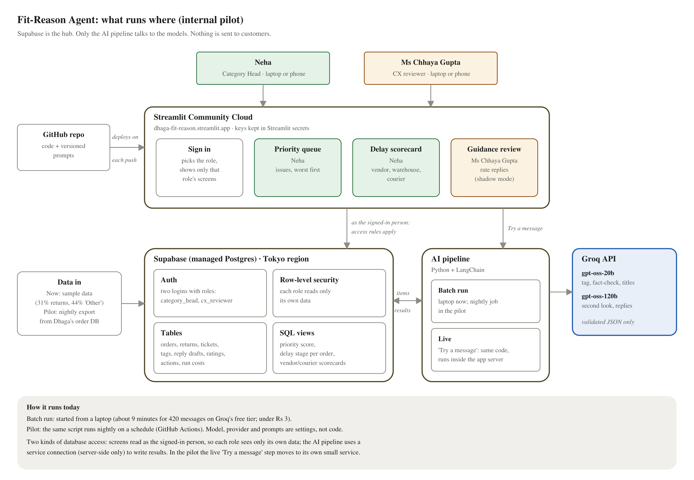

# Fit-Reason Agent

**Every return tells us why. Now we can listen.**

An internal pilot for Dhaga & Co. that reads every return reason and customer message (English, Hindi or Hinglish) and sends what it finds to the person who can act on it.

- **Live demo:** https://dhaga-fit-reason.streamlit.app opens without a sign-in, straight into Neha's view. Add `?as=chhaya` for Ms Chhaya Gupta's. Sample data only.
- **Built for:** FDE Academy · Tech Track · Mini Project 1, "The Dhaga & Co. Engagement"
- **Submission documents:** [see below](#submission-documents)

---

## Submission documents

Everything handed in for the FDE Academy Mini Project lives in [`docs/`](docs):

| Document | What it is |
|---|---|
| [Discovery note](docs/DISCOVERY_NOTE.md) | One page, dated before the first code commit: the problem, owner, evidence, cost, success measures, ranked shortlist and biggest assumption. Also as [plain text](docs/DISCOVERY_NOTE.txt). |
| [Product Requirements Document](docs/Product-Requirements-Document.docx) | The business case, users, solution, alternatives considered, flows, acceptance criteria and timeline (FDE template). |
| [Technical Architecture Document](docs/Technical-Architecture-Document.docx) | Architecture, data flow, data model, tech stack, model settings, security, operations, cost and likely questions. |
| [CXO pitch deck](docs/CXO-Pitch-Deck.pptx) | 13 slides for the client meeting plus a 4-slide appendix (architecture, information flow, cost and profit, data). Speaker notes include the demo script. |
| [UX screens](docs/UX-Screens.pdf) | The built screens on desktop and phone, including the deliberate failure case. |
| [Diagrams](docs/diagrams) | Architecture, data flow, data model and processing pipeline as images. |

---

## What it does

Dhaga & Co. gets about 14,880 returns a week (31% of orders), and 44% of them give only "Other" as the reason. The Category Head can read a few hundred of those comments by hand. Fit-Reason reads all of them, plus the support tickets, and turns them into three screens. Each person sees only their own screens.

| Screen | Who uses it | What it shows |
|---|---|---|
| **Priority queue** | Neha, Category Head | Complaints grouped into issues (e.g. "V-17 kurtas run a size small"), ranked by a score, with the size-chart gap and real customer quotes. One click to Fix, Escalate to vendor, Monitor or mark Wrong tag. |
| **Delay scorecard** | Neha, Category Head | Late orders blamed on whoever caused the delay: the vendor (waiting for stock), the warehouse (slow to dispatch) or the courier (slow in transit). Repeat offenders are flagged, and every number opens the orders behind it. |
| **Guidance review** | Ms Chhaya Gupta, CX reviewer | A suggested reply to each customer question, in the customer's own language, built only from facts in Dhaga's records and fact-checked before a person sees it. **Shadow mode: nothing is sent to customers.** |

**Running it on sample data**

| Measure | Result |
|---|---|
| Returns with a usable reason | 90%, up from 56% |
| Messages read | 420 |
| Reply suggestions | 95 |
| Total AI cost | ₹2.89 |

---

## Demo walkthrough (no sign-in needed)

The live link opens straight into Neha's view. Each person still sees only their own screens; switching role signs in as the other person behind the scenes.

1. **Open** https://dhaga-fit-reason.streamlit.app. It lands on Neha's **Priority queue**.
2. **Point at the first tile:** returns with a usable reason went from 56% to about 90%.
3. **Click the top issue, "V-17 kurta runs small".** Show the size chart (2 inches tighter than standard) and read a customer quote aloud. Click **Fix size chart** to show the action is recorded.
4. **Open "Delay scorecard"** from the menu (on a phone it's behind » at the top left). Point at the vendor flagged **Recurring**, then at the stage bars showing where the time was lost.
5. **Click "Switch to Ms Chhaya Gupta"** under the name at the top right. The view changes to **Guidance review**, the only screen her role has.
6. **Pick the message labelled "... DH-48213 · fit".** Show the kurta, the facts used and the Hinglish reply quoting 36 vs 38 inches and the exchange deadline. Rate it **Send as-is**; nothing is sent to the customer.
7. **Show the deliberate failure:** pick "refund kab milega, 2000 wapas chahiye ... DH-47790". It refuses to promise a refund date and hands the message to a person.
8. **Optional, live:** type a message in **Try a message** (with an order number such as DH-48213) and click **Run**. A new suggestion appears in about 10 seconds.
9. **Click "Switch to Neha"** to go back.

Shortcut: https://dhaga-fit-reason.streamlit.app/?as=chhaya opens Ms Chhaya Gupta's view directly.

---

## Quick start (about 5 minutes)

### What you need

- Python 3.12
- A free [Supabase](https://supabase.com) project
- A free [Groq](https://console.groq.com) API key. Or use OpenRouter instead (see [Configuration](#configuration)).

### Steps

```bash
# 1. Get the code and install
git clone https://github.com/chakrabortysomdatta-maker/fit-reason-agent.git
cd fit-reason-agent
python -m venv .venv
source .venv/bin/activate          # Windows: .venv\Scripts\activate
pip install -r requirements.txt

# 2. Add your keys
cp .env.example .env               # then fill in the values (see Configuration)

# 3. Create the database, load sample data, create the two logins
python scripts/setup_db.py

# 4. Let the AI read the data (about 10 minutes on Groq's free tier)
python scripts/run_pipeline.py 40  # 40 = how many tickets get a suggested reply

# 5. Start the app
streamlit run app.py               # opens http://localhost:8501
```

The app opens straight into Neha's view (**demo mode**, on by default). Use **Switch to Ms Chhaya Gupta** by the name, or open `http://localhost:8501/?as=chhaya`. With `DEMO_MODE=false` you get the sign-in page instead: username **`neha`** or **`chhaya.gupta`** and the password from `.env`.

---

## Configuration

All settings live in `.env` locally. On Streamlit Community Cloud they live in the app's **Secrets**. Nothing secret is committed to this repository.

| Setting | Required | What it is |
|---|---|---|
| `SUPABASE_URL` | yes | Project URL, e.g. `https://<ref>.supabase.co` (Project Settings → Data API) |
| `SUPABASE_ANON_KEY` | yes | The **publishable** key. The app uses it to read data as the signed-in person. |
| `SUPABASE_SERVICE_KEY` | setup only | The **secret** key. Used only by `setup_db.py` to create the logins. |
| `SUPABASE_DB_URL` | yes | Connection string, Session pooler (Connect button). Percent-encode special characters in the password (`@` becomes `%40`). |
| `GROQ_API_KEY` | yes* | Groq key. *Or `OPENROUTER_API_KEY` with `LLM_PROVIDER=openrouter`. |
| `LLM_PROVIDER` | no | `groq` (default) or `openrouter` |
| `FAST_MODEL` / `STRONG_MODEL` | no | Defaults: `openai/gpt-oss-20b` (tagging, checks) / `openai/gpt-oss-120b` (unsure items, replies) |
| `NEHA_PASSWORD`, `CHHAYA_PASSWORD` | setup + demo mode | Passwords for the two demo logins. Demo mode uses them server-side, so the link opens without a sign-in. |
| `DEMO_MODE` | no | `true` by default (no sign-in page). Set to `false` to require sign-in. |
| `INR_PER_USD` | no | Exchange rate for the cost meter (default 88) |
| `MODEL_CALLS_ENABLED` | no | Set to `false` to stop every AI call (kill switch) |

---

## What it expects (inputs)

- **Orders, catalogue and events.** Orders with lines, products (SKUs) with their vendor and size chart, and order status events: placed → stock available → handed to courier → delivered.
- **Customer text.** Return comments (the "Other" box) and support tickets, as free text in English, Hindi or Hinglish. Typos and very short messages are normal. Ticket order numbers look like `DH-48213` and are often missing.
- **Business settings.** These are tables, not code: stage targets, delivery days by zone, category weights, and the minimum number of complaints before an issue ranks.
- **Demo data is sample data.** `scripts/sample_data.py` generates it with a fixed seed, shaped to the client brief:
  - 31% of orders returned, 44% of returns marked "Other", 61% cash on delivery
  - Hinglish comments
  - 40 vendors in Tiruppur and Jaipur
  - Some problems are planted so the demo has something to find, e.g. V-17's size chart is 2 inches tight.
- **In a pilot,** a nightly export from Dhaga's order database replaces the sample data.

---

## What it does when something goes wrong

The rule is that it **fails visibly**: no silent wrong answers.

| Situation | What happens |
|---|---|
| A message is too short or vague ("bekaar") | No AI call. Marked "not enough information" and listed under **Check tag**. |
| The AI is unsure of a tag | A second look by the stronger model. If still unsure, it goes to **Check tag** for a person. |
| The AI returns something malformed | Every answer must match a fixed structure. It retries once with the error, then shows as **Unclassified** and is counted on screen. Never dropped. |
| A suggested reply contains a date, amount or promise not in the records | The fact-check rejects it, and it is redrafted once. If it fails again: **Needs a person**, with the reason shown. |
| A refund question with no refund date on record | Handed straight to a person, by a rule in code. No AI draft. |
| An order number in a message doesn't exist | It is ignored, and the message is treated as having no linked order. |
| The AI provider is slow or rate-limited | The call waits and retries automatically. Batches of 15 messages per call keep within Groq's free-tier limits. |
| Someone opens a screen outside their role | It isn't in their menu. Even if requested directly, the database's access rules return no rows. |
| The database settings are missing on deploy | The sign-in page names the missing setting and which secret names the app can see. |

---

## How it works



- **Screens:** Streamlit, hosted on Streamlit Community Cloud. It redeploys on every push to `main`.
- **Database and logins:** Supabase (Postgres) holds 23 tables and 6 views. Each login has a role, and **row-level security** in the database decides what each role can read.
- **AI pipeline:** Python and LangChain calling Groq.
  - The cheap model tags 15 messages per call and fact-checks replies.
  - The stronger model handles unsure items and drafts replies.
- **The code-versus-AI line:** every count, date calculation, lookup and score is plain code or SQL. The AI is used only for reading and writing language.
- **Structured outputs:** every AI answer is checked against a fixed structure (Pydantic) before it is used.

More detail:
- [Data flow](docs/diagrams/data-flow.png)
- [Data model](docs/diagrams/data-model.png)
- [Processing pipeline](docs/diagrams/processing-pipeline.png)
- [Technical Architecture Document](docs/Technical-Architecture-Document.docx)

### Two kinds of database access (known gap)

- **The screens** read and write as the signed-in person, so the access rules apply.
- **The AI pipeline** uses a service connection, server-side only, to write its results.
- **The gap:** the live "Try a message" box runs that pipeline inside the app, so the hosted app holds the database connection string. It never reaches the browser.
- **Pilot fix:** move the live step to its own small service with a restricted database role.

---

## Cost

| | Per item | Pilot (per month) |
|---|---|---|
| Tag a message (gpt-oss-20b) | about ₹0.0024 | |
| Second look (gpt-oss-120b) | about ₹0.017 | |
| Suggested reply incl. fact-check | about ₹0.027 | |
| AI calls at pilot volume | | about ₹420 |
| Database (Supabase Pro) | | about ₹2,200 |
| Hosting (Streamlit Community Cloud) | | ₹0 |
| **Total** | | **about ₹2,600** |

- **Per-item costs** are measured from the demo run, at Groq list prices and ₹88 = $1.
- **Logging:** every run records its tokens and cost in the `runs` table.
- **Free tier:** Groq's free tier allows 8,000 tokens a minute. That's enough for the demo, but the pilot needs the pay-as-you-go plan.

---

## Project structure

```
app.py                 sign-in and role-based menu
views/                 the three screens: queue.py, scorecard.py, guidance.py
core/
  pipeline.py          the AI pipeline: tag, group, title, draft and fact-check
  llm.py               model access (Groq or OpenRouter), retries, cost tally
  schemas.py           the fixed structures every AI answer must match
  prompts/             versioned prompt files
  session.py           sign-in and per-user database access
  config.py            settings from .env or Streamlit secrets
  garments.py          product illustrations
  ui.py                shared look
db/                    01_schema.sql, 02_views.sql (all calculations), 03_security.sql (access rules)
scripts/
  sample_data.py       generates the sample data
  setup_db.py          creates tables, loads data, creates logins
  run_pipeline.py      the batch run
  ui_check.py          signs in as each role and screenshots every screen (needs Playwright + Edge)
  deploy_space.py      optional Hugging Face deploy (needs HF PRO)
docs/                  submission documents, diagrams/ and screens/ (screenshots from scripts/ui_check.py)
```

---

## Deploying (Streamlit Community Cloud)

1. On share.streamlit.io, choose **Create app** and pick this repository, branch `main`, file `app.py`, Python 3.12.
2. Under **Settings → Secrets**, paste your settings. Either:
   - One `NAME = "value"` per line, or
   - All of them on one line as `FIT_REASON = { SUPABASE_URL = "...", SUPABASE_ANON_KEY = "...", ... }`. This is useful if multi-line pastes get cut off.
3. **Save**, then **Reboot app**. After that, every push to `main` redeploys automatically.

The hosted app needs these settings:
- Required: `SUPABASE_URL`, `SUPABASE_ANON_KEY`, `SUPABASE_DB_URL` and `GROQ_API_KEY`
- For the no-sign-in demo link: `NEHA_PASSWORD` and `CHHAYA_PASSWORD`
- Optional: the model settings, `DEMO_MODE`

It does **not** need the Supabase secret key.

---

## Known limitations

- Demo mode means anyone with the link can click actions, rate replies and use "Try a message" (about ₹0.03 each). That's fine for sample data; set `DEMO_MODE=false` for a pilot on real data.
- Without demo mode, refreshing the browser signs you out (Streamlit sessions). With it, a refresh opens Neha's view again.
- Free-tier apps sleep after a few days without visits. The first visit takes about 30 seconds to wake.
- The batch run is started by hand today. In the pilot it becomes a nightly scheduled job.
- The sample data is about 1/190 of Dhaga's real weekly volume. The minimum items per issue is set to 3 for it (5 on real data).
